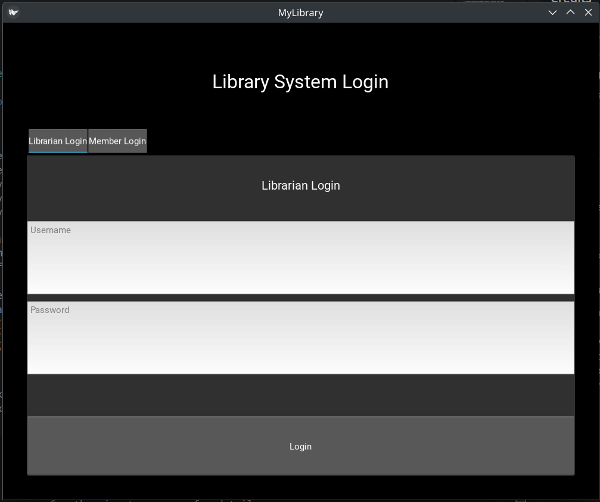
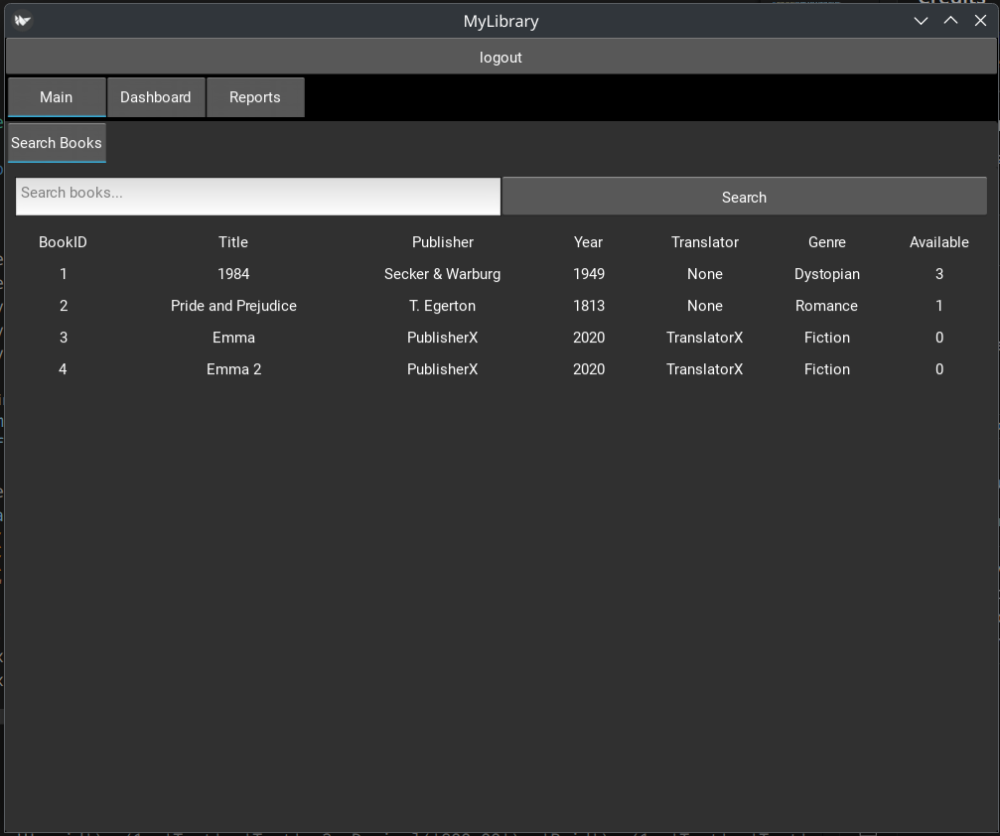
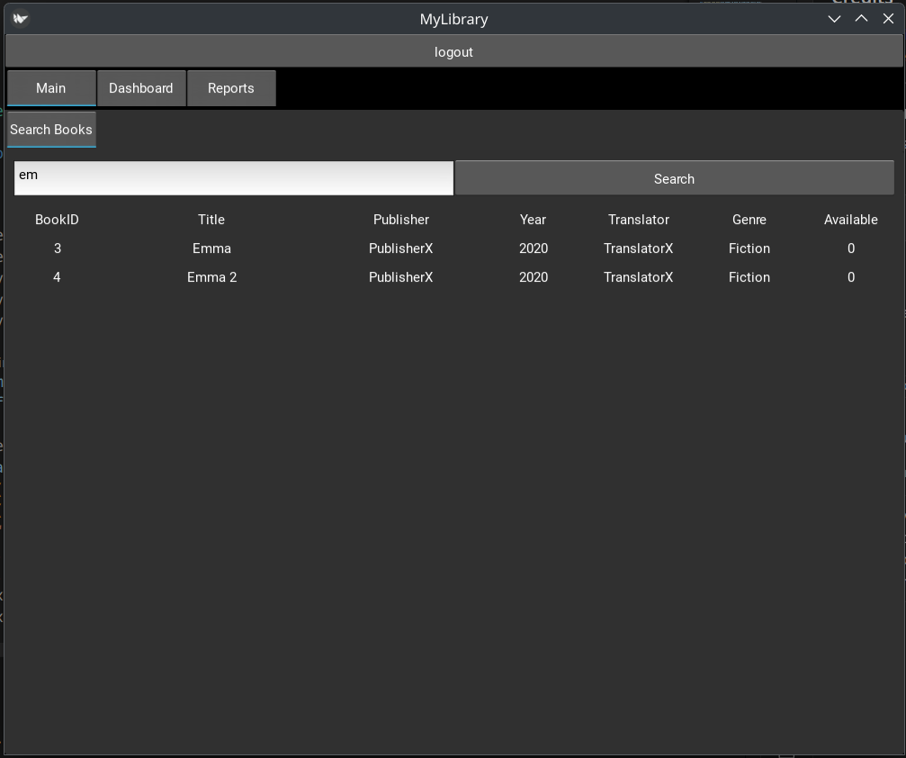
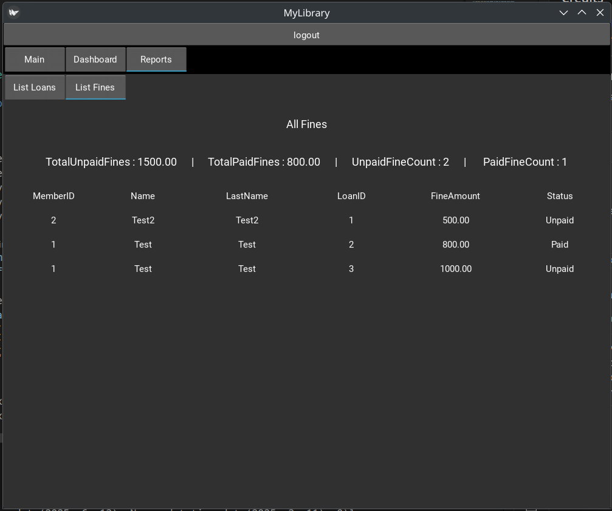
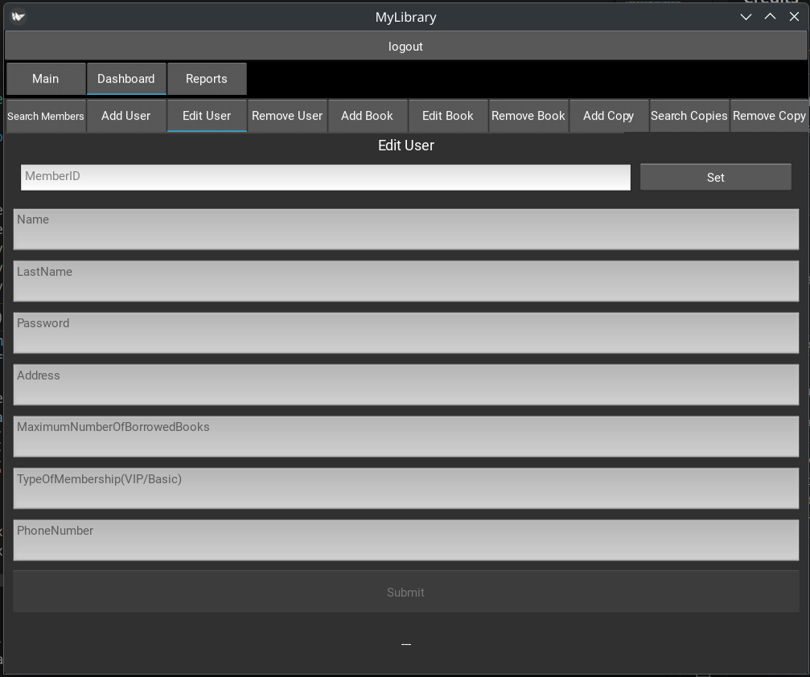
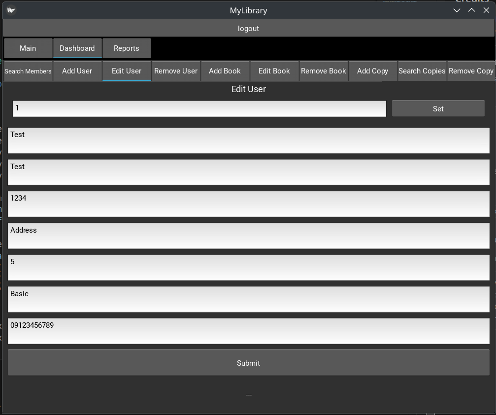

# Library Management System (Kivy)

A modern, tabbed, multi-role library management UI built with [Kivy](https://kivy.org/) in Python.  
This project provides a clean, extensible interface for both **members** and **librarians** to interact with a library database.<br>
This was the final project of database course<br>
faze 1 : semantic and logical design of database<br>
faze 2 : implementation using sql server and python(Kivy framework for UI)
---

## Features

- **Login Screen:**  
  - Tabbed login for Librarian and Member roles.

- **Member Dashboard:**  
  - **Search Books:** Search and view books in a table/chart format.
  - **Borrowed Books:** View currently borrowed books.
  - **Fines:** View outstanding fines.

- **Librarian Dashboard:**  
  - **Search Books:** Search and view books.
  - **Search Members:** Search and view library members.
  - **User Management:** Add, edit, and remove users.
  - **Book Management:** Add, edit, and remove books and copies.
  - **Loan Management:** Edit loans, view all loans (with count), and manage fines.
  - **Reports:** View lists of all loans and fines.

- **Tabbed Navigation:**  
  - Intuitive tabbed layout for quick access to all features.

---

## Screenshots









---

## Getting Started

### Prerequisites

- Python 3.8+
- [Kivy](https://kivy.org/doc/stable/gettingstarted/installation.html)
- [pyodbc](https://github.com/mkleehammer/pyodbc) (for database connection)
- Microsoft SQL Server (or compatible, for backend)
- ODBC Driver 17 for SQL Server

### Installation

1. **Clone the repository:**
    ```sh
    git clone https://github.com/yourusername/library-app-kivy.git
    cd library-app-kivy
    ```

2. **Install dependencies:**
    ```sh
    pip install kivy pyodbc
    ```

3. **Set up the database:**
    - run
    ```sh
    docker run -e 'ACCEPT_EULA=Y' -e 'SA_PASSWORD=Str0ngPassw0rd!' -p 1433:1433 --name sql1 -d mcr.microsoft.com/mssql/server:2022-latest
    ```
    - Use the provided `code.sql` to create and initialize your SQL Server database.
    - Update the connection string in `database.py` if needed.

4. **Run the app:**
    ```sh
    python main.py
    ```

---

## Project Structure
### Faze 1 :
- `database.pdf` — Semantic and logical design of  database
### Faze 2 :
- `main.py` — Main application logic and screen management.
- `database.py` — Database connection and query logic.
- `library.kv` — Kivy UI definitions (tabs, layouts, widgets).
- `code.sql` — SQL Server schema and stored procedures.

---

## Customization

- **UI:**  
  Modify `library.kv` to change layouts, add widgets, or adjust styles.
- **Database:**  
  Update `database.py` to match your schema or add new queries.
- **Logic:**  
  Extend `main.py` to add new features or business rules.

---

## Troubleshooting

- **Clipboard Warnings:**  
 If you see warnings about `xclip` or `xsel`, install them with:
  ```sh
  sudo pacman -S xclip xsel
  ```
 Or ignore if you don't need clipboard support.

- **Database Connection Errors:**
Ensure your SQL Server is running, the database exists, and credentials are correct.
- **UI Not Updating:**
Make sure your RecycleView data is set as a list of dictionaries matching the viewclass properties.

## Team members:
 https://github.com/BehrazFS <br>
 https://github.com/RozhinaLatifi
